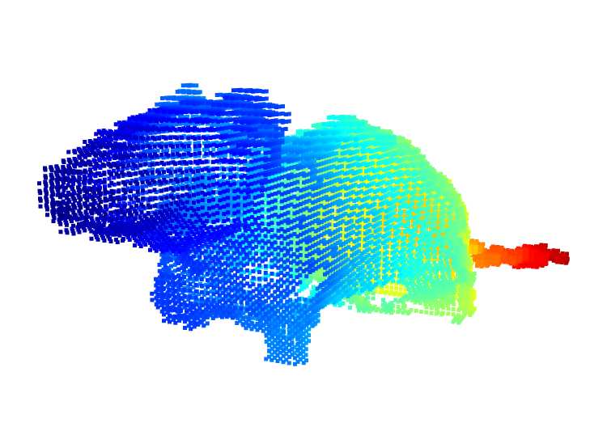

# ndx-point-cloud-table Extension for NWB

## Installation

```shell script
pip install ndx-point-cloud-table
```

## Usage

```python
from datetime import datetime
from glob import glob
import os

from tqdm import tqdm

import numpy as np
import open3d as o3
from pynwb import NWBFile, NWBHDF5IO
from ndx_point_cloud_table import PointCloudTable


data_dir = '/Users/bendichter/data/Soltesz/Tilo/PointCloud/'
ply_dir = os.path.join(data_dir, 'points')
ply_fpaths = glob(ply_dir + '/*.ply')
time_fpath = os.path.join(data_dir, 'frame_ts.txt')

tt = np.genfromtxt(time_fpath, delimiter=" ", usecols=[1])
nwb = NWBFile('session_description', 'identifier', datetime.now().astimezone())

point_cloud_table = PointCloudTable(name='PointCloudTable', description='description')

for fpath, t in tqdm(list(zip(ply_fpaths, tt))):
    pcd = o3.io.read_point_cloud(fpath)
    point_cloud_table.add_row(point_cloud=np.asarray(pcd.points), timestamps=t)

behavior_mod = nwb.create_processing_module('behavior', 'desc')
nwb.processing['behavior'].add(point_cloud_table)

# Write nwb file
with NWBHDF5IO('test_pointcloudtable.nwb', 'w') as io:
    io.write(nwb)

# Read nwb file and check its content
with NWBHDF5IO('test_pointcloudtable.nwb', 'r', load_namespaces=True) as io:
    nwb2 = io.read()
    xyz = nwb2.processing['behavior'].data_interfaces['PointCloudTable']['point_cloud'][3]

# visualization
pcd = o3.geometry.PointCloud()
pcd.points = o3.utility.Vector3dVector(xyz)
o3.visualization.draw_geometries([pcd])
```


